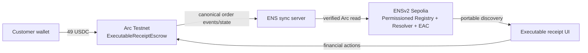

# Architecture

Arc is the canonical financial state. ENSv2 is the portable receipt identity, metadata, discovery and permission layer. The browser sends only an order identifier to synchronization; the server re-reads Arc and derives every record.
